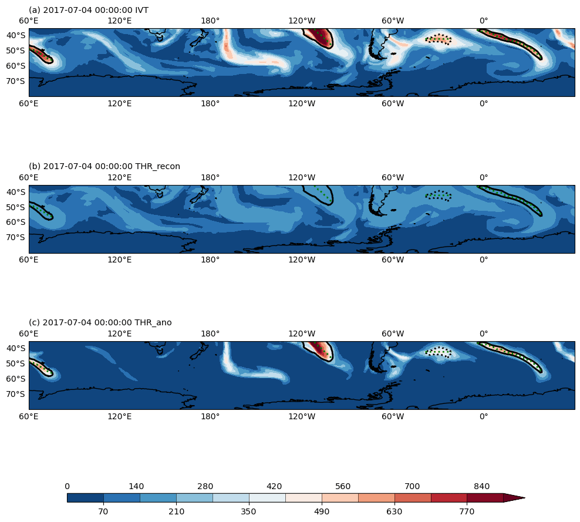

# ar-detection

## Atmospheric river detection

This script uses integrated vapour transport (northward and eastward) data from the [European Center for Medium-Range Weather Forecasts Reanalysis](https://www.ecmwf.int/en/forecasts/dataset/ecmwf-reanalysis-v5) (ERA5) data to detect and track atmospheric rivers using the [IPART](https://ipart.readthedocs.io/en/latest/) Python package.

Script contains parameters set to identify the AR that preceded the A68 iceberg calving event from the Larsen C Ice Shelf in July 2017.
- Examples of script outputs provided

&nbsp;

  

&nbsp;
   
### References
Wille, J., Favier, V., Jourdain, N., Kittel, C., Turton, J., et al. (2022). Intense atmospheric rivers can weaken ice shelf stability at the Antarctic Peninsula. *Communications Earth & Environment, 3*(1), 1-14. doi:[10.1038/s43247-022-00422-9](https://www.nature.com/articles/s43247-022-00422-9)

Xu, G., Ma, X., & Chang, P. (2020). IPART: A Python package for image-processing based atmospheric river tracking. *Journal of Open Source Software, 55*(55), 2407. doi:[10.21105/joss.02407](https://doi.org/10.21105/joss.02407))
